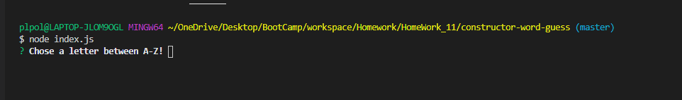

# Advanced JavaScript: Constructor Word Guess

### Overview
Using node.js and inquirer.js this application allows a user to guess the correct letter to a pre determined word that was randomly generated for the cars array.

### How to play: 
    
    1. Open Terminal in the "constructor-word-guess" directory 
            - run `node index.js`
    
    2. Once above command ran, user should be able to input a letter
        